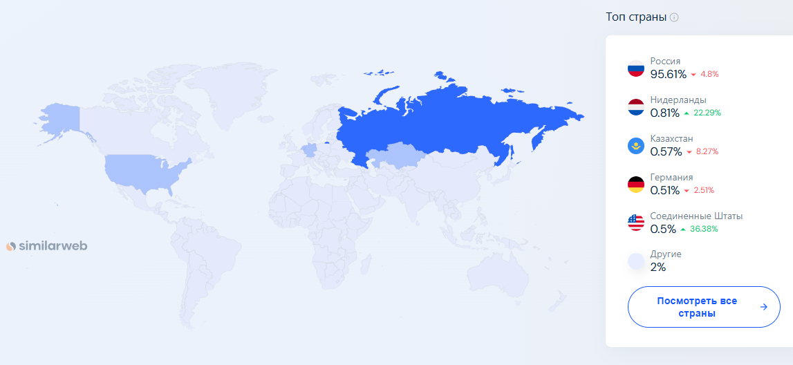

# Проектирование высоконагруженного аналога 2ГИС
## 1. Тема и целевая аудитория
### 1.1 Описание сервиса
«2ГИС» - российская цифровая экосистема со справочником городов, картой,
навигатором и другими полезными опциями. Сервис помогает находить нужные места,
строить маршруты, ориентироваться в городе и принимать решения на ходу.

### 1.2 Целевая аудитория
- Количество пользователей в месяц(**MAU**): 60 млн за второй квартал 2025 [1](https://www.similarweb.com/ru/website/2gis.ru/#overview)
- Количество пользователей в день(**DAU**): 20 млн за первый квартал 2024 [1](https://www.similarweb.com/ru/website/2gis.ru/#overview)
- Географическое положение: Азербайджан,
                            Армения,
                            Беларусь,
                            Грузия,
                            Казахстан,
                            Кыргызстан,
                            Россия,
                            Узбекистан.

### 1.3 Ключевой функционал сервиса
- Просмотр карточки организации (адрес, телефон, график работы, рейтинг, фото, отзывы)
- Просмотр зданий, входов и этажей
- Поддержка тематических слоёв карты (трафик, транспорт, парковки, велодорожки и др.)
- Инкрементальное обновление скачанных карт

### 1.4 Ключевые продуктовые решения
- Геопоиск рядом с пользователем
- Поиск организаций по названию, категории и ключевым словам
- Скачивание карт регионов для оффлайн-использования
- Оффлайн-поиск и оффлайн-маршрутизация

## 2. Расчет нагрузки
---

## 2.1 Продуктовые метрики

### Сводная таблица продуктовых метрик

| Метрика | Значение | Источник |
| :--- | :--- | :--- |
| **Monthly Active Users (MAU)** | 60 млн | Similarweb: оценка аудитории 2gis.ru ([1](https://www.similarweb.com/ru/website/2gis.ru/#overview)) |
| **Daily Active Users (DAU)** | 20 млн | **Допущение** (stickiness ≈ 30% от MAU ([10](https://americanchase.com/mobile-app-kpi-metrics/))). Прямой публичной DAU-метрики 2ГИС нет в открытом доступе |
| **Среднее количество открытий карты** | ≈1.7/день | Google Maps: ~50 сессий/мес => 50/30≈1.7 сессии/день ([2](https://localzen.com/blog/google-maps-statistics-and-interesting-facts/)) |
| **Поисковые запросы (всего)** | >20.5 млн/сут | “processing more than 20.5 million search queries daily” (company data, 2021) ([3](https://en.wikipedia.org/wiki/2GIS)) |
| **Среднее количество поисковых запросов на пользователя** | ≈1.0/день | **Вывод:** 20.5 млн поисков/сут ÷ 20 млн DAU ≈ 1.0/польз/день. (по строкам выше) |
| **Среднее количество просмотров карточек организаций** | ≈1.17/день | **Вывод:** ~1.0 поиска/день × 1.17 клика/поиск [clickthrough](https://www.cs.cornell.edu/people/tj/publications/joachims_02b.pdf). Joachims: “average number of clicks per query is 1.17” ([4](https://www.cs.cornell.edu/~tj/publications/joachims_02b.pdf)) |
| **Среднее количество построений маршрута** | 0.2/день | 6.5 мллрд в год => (6.5 млрд / 360)/95млн ([7](https://www.comss.ru/page.php?id=18998))|
| **Использование тематических слоёв (пробки/транспорт)** | 0.5/день | **Допущение** (публичной метрики “traffic layer usage per user/day” нет) Цифра взята из личного опыта|
| **Загрузка офлайн-карт** | 0.02/день | **Допущение:** ~1 загрузка собственного города + обновление раз в 50 дней (редкое событие) |
| **Размер офлайн-карт** | 30 МБ - 1 ГБ| Официальная справка 2ГИС: “Москва до 1 ГБ… небольшой город 30–50 МБ” ([8](https://help.2gis.ru/question/offline-maps)) |
| **Средний размер ответа карточки (Place Details)** | 3-8 КБ | **Оценка** (зависит от набора полей и текста) Средний вес GET запроса на сайти |
| **Средний размер результата поиска (список мест)** | 2–6 КБ | **Оценка** (зависит от числа результатов/полей). Средний вес GET запроса на сайти |
| **Средний размер маршрута (Directions)** | 4–12 КБ | **Оценка** Средний вес GET запроса на сайти |

## 2.2 Технические метрики

### Расчёт объёма хранения
Расчёт производится для хранения данных, генерируемых за **1 год** использования сервиса.

| Тип данных | Формула расчёта для 1 пользователя | Общий объём данных |
| :--- | :--- | :--- |
| **Информация о местах (карточки организаций)** | 1.17 просмотров × 365 д. × 5 КБ ≈ 2.1 МБ | **≈42 ТБ** |
| **Поисковые запросы** | 1 поиск × 365 д. × 2 КБ ≈ 0.73 МБ | **≈14.6 ТБ** |
| **Маршруты** | 0.2 маршрутов × 365 д. × 8 КБ ≈ 2.04 МБ | **≈11.8 ТБ** |
| **Тематические слои (пробки/транспорт)** | 0.5 × 365 × 4 КБ ≈ 0.73 МБ | **≈14.6 ТБ** |
| **Итого** | **≈5.6 МБ на пользователя** | **≈112 ТБ** |

---

### Сетевой трафик
k = Peak / Average
Пиковый час составляет примерно 8.4% суточного трафика. [9](https://www.precisiontrafficsafety.com/solutions/traffic-studies/)
Cредняя часовая нагрузка равна 1/24 ≈ 4.17%.
k = 8.4/4.17 ≈ 2.0
При расчёте используется коэффициент суточной неравномерности **k = 2** для определения пиковой нагрузки.

| Тип трафика | Суточный объём (ТБ/сут) | Средний трафик (Гбит/с) | Пиковый трафик (k=2) |
| :--- | :--- | :--- | :--- |
| **Карточки организаций** | 20 млн × 1.17 × 5 КБ ≈ 117 ТБ | 10.8 | 21.6 |
| **Поиск организаций** | 20 млн × 1 × 2 КБ ≈ 40 ТБ | 3.7 | 7.4 |
| **Маршруты** | 20 млн × 0.2 × 8 КБ ≈ 112 ТБ | 10.3 | 5.7 |
| **Тематические слои** | 20 млн × 0.5 × 4 КБ ≈ 40 ТБ | 3.7 | 7.4 |
| **Отображение карты (тайлы)** | 20 млн × 1.7 × 8 КБ ≈ 272 ТБ | 25.2 | 50.4 |
| **Итого** | **≈581 ТБ/сут** | **≈53.7** | **≈107.4** |

---

### Расчёт RPS (Requests Per Second)

RPS рассчитывается по формуле:,

**RPS = (DAU × действия в сутки) / 86 400**

| Тип запроса | Общее кол-во запросов в сутки | Средний RPS | Пиковый RPS (k=2) |
| :--- | :--- | :--- | :--- |
| **Отображение карты** | 20 млн × 1.7 = 34 млн | 393 | 786 |
| **Просмотр карточек организаций** | 20 млн × 1.17 = 23.4 млн | 271 | 542 |
| **Поиск организаций** | 20 млн × 1 = 20 млн | 231 | 462 |
| **Построение маршрутов** | 20 млн × 0.2 = 4 млн | 45 | 90 |
| **Тематические слои** | 20 млн × 0.5 = 10 млн | 116 | 231 |
| **Обновление офлайн-карт** | 20 млн × 0.02 = 0.4 млн | 4.6 | 9.2 |
| **Итого** | **≈101.8 млн** | **≈1 178** | **≈2 354** |

# 3. Глобальная балансировка нагрузки

## 3.1 Функциональное разбиение по доменам

Разделяем контуры, чтобы независимо масштабировать и кэшировать разные типы нагрузки:

- `tiles.2gis.ru` - **тайлы карты**
- `api.2gis.ru` - **поиск + карточки организаций**
- `route.2gis.ru` - **маршрутизация**
- `cdn.2gis.ru` - **офлайн-пакеты**
- `2gis.ru` - **основной сайт**

---

## 3.2 Обоснование расположения ДЦ

Берём распределение трафика по странам по Similarweb для `2gis.ru` (последний месяц):

- **Россия - 95.61%**
- Нидерланды - 0.81%
- **Казахстан - 0.57%**
- Германия - 0.51%
- США - 0.50%
- Другие - 2% 

Вывод: подавляющая часть аудитории - **Россия**, затем - **Казахстан и прочие страны**.  
Значит ДЦ логично ставить так, чтобы:
- минимизировать задержку для РФ => быстрее грузятся тайлы/поиск/маршруты => выше удовлетворённость;
- иметь **гео-резерв** внутри РФ (чтобы не падать от аварии одного региона);
- вынести в **EU** (ближний и удобный регион для внешнего трафика).

Предлагаемые ДЦ:

- **Москва (RU-West)** - основной регион, ближе к большинству пользователей РФ  
- **Новосибирск (RU-East)** - второй регион РФ (георезерв + ближе к восточной части РФ)
- **Алматы (KZ)** - локальная точка для Казахстана (пусть доля небольшая, но логично)
- **Франкфурт (EU)** - агрегируем Netherlands/Germany/US/Others как “вне РФ”

---

## 3.3 Распределение запросов из “Расчёт нагрузки” по ДЦ

Берём Peak RPS из п.2.2:
- Отображение карты: **786**
- Просмотр карточек организаций: **542**
- Поиск организаций: **462**
- Построение маршрутов: **324**

Распределение по ДЦ на основе Similarweb:
- Russia 95.61% делим внутри РФ: **Москва 65%**, **Новосибирск 30.61%**
- Kazakhstan 0.57% => **Алматы 0.57%**
- Остальные (Netherlands+Germany+US+Others = 3.82%) => **Франкфурт 3.82%*

Формула:
`Peak_RPS_DC = Peak_RPS_Total × доля_DC`

| Тип запроса | Peak RPS (итого) | Москва (65%) | Новосибирск (30.61%) | Алматы (0.57%) | Франкфурт (3.82%) |
|---|---:|---:|---:|---:|---:|
| **Отображение карты** | 786 | 510.9 | 240.6 | 4.5 | 30.0 |
| **Информация о местах** | 542 | 352.3 | 165.9 | 3.1 | 20.7 |
| **Поиск мест и организаций** | 462 | 300.3 | 141.4 | 2.6 | 17.6 |
| **Построение маршрутов** | 324 | 210.6 | 99.2 | 1.8 | 12.4 |

Примечание: “Офлайн-карты” и “тайлы” лучше считать как CDN-трафик, а не как нагрузку на API-ДЦ.

---

## 3.4 Схема DNS балансировки

Для балансировки пользовательского трафика используется **Geo-Based DNS**.  
DNS определяет регион пользователя по IP-адресу и направляет запрос в ближайший дата-центр.

---

## 3.5 Схема Anycast балансировки

**Anycast** — это метод маршрутизации, при котором один IP-адрес объявляется из нескольких точек сети.

Маршрутизация интернета автоматически направляет пользователя к ближайшему узлу.
Этот механизм активно используется CDN-сетями для доставки картографических тайлов и статических данных.

[“The anycast IP address is used to distribute traffic amongst Cloudflare's network, which protects your website or app from DDoS ↗ and other attacks, while optimizing site speed.”](https://developers.cloudflare.com/fundamentals/concepts/how-cloudflare-works/)
## Сслыки на источники
1. [Аналитика трафика 2ГИС](https://www.similarweb.com/ru/website/2gis.ru/#overview)
2. [37 Google Maps Statistics and Interesting Facts](https://localzen.com/blog/google-maps-statistics-and-interesting-facts/)
3. [2ГИС wiki](https://developer.android.com/topic/performance/vitals](https://en.wikipedia.org/wiki/2GIS))
4. [Evaluating Retrieval Performance using Clickthrough Data - статья про clickthrough](https://www.cs.cornell.edu/~tj/publications/joachims_02b.pdf)
5. [Исследование Яндекс карт лето 2016](https://yandex.ru/company/researches/2016/ya_walk)
6. [Вики яндекс карт 2016 год](https://en.wikipedia.org/wiki/Yandex_Maps)
7. [Статистика яндекс карт 2026 год](https://www.comss.ru/page.php?id=18998)
8. [Официальная статистика 2ГИС](https://help.2gis.ru/question/offline-maps)
9. [Traffic Studies](https://www.precisiontrafficsafety.com/solutions/traffic-studies/)
10. [25 ключевых показателей эффективности мобильных приложений](https://americanchase.com/mobile-app-kpi-metrics/)
11. [How Cloudflare DNS works](https://developers.cloudflare.com/fundamentals/concepts/how-cloudflare-works/)

