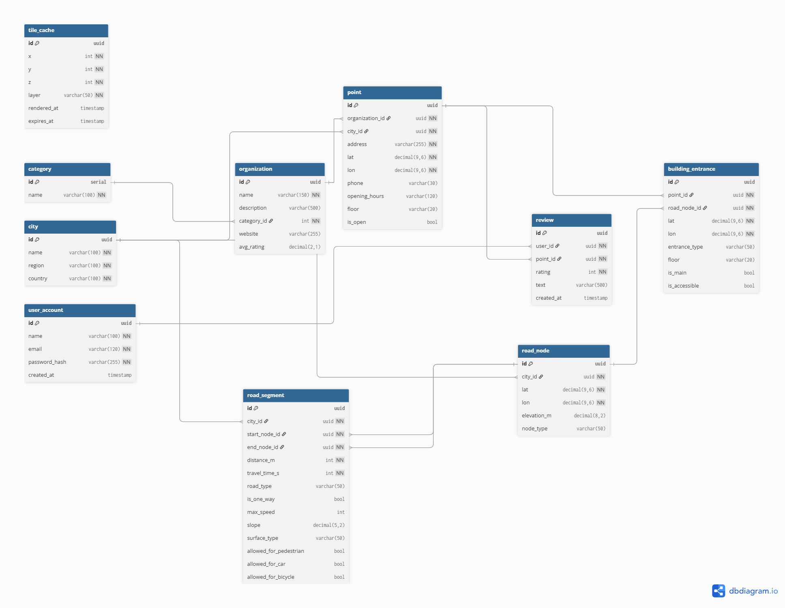
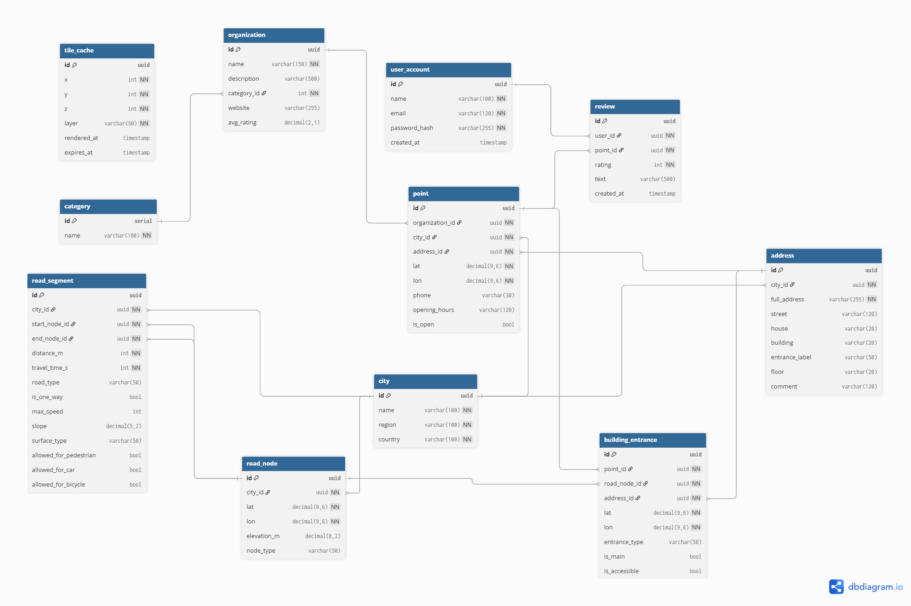

# Проектирование высоконагруженного аналога 2ГИС
## 1. Тема и целевая аудитория
### 1.1 Описание сервиса
«2ГИС» - российская цифровая экосистема со справочником городов, картой,
навигатором и другими полезными опциями. Сервис помогает находить нужные места,
строить маршруты, ориентироваться в городе и принимать решения на ходу.

### 1.2 Целевая аудитория
- Количество пользователей в месяц(**MAU**): 60 млн за второй квартал 2025 [1](https://www.similarweb.com/ru/website/2gis.ru/#overview)
- Количество пользователей в день(**DAU**): 20 млн за первый квартал 2024 [1](https://www.similarweb.com/ru/website/2gis.ru/#overview)
- Географическое положение: Азербайджан,
                            Армения,
                            Беларусь,
                            Грузия,
                            Казахстан,
                            Кыргызстан,
                            Россия,
                            Узбекистан.

### 1.3 Ключевой функционал сервиса
- Просмотр карточки организации (адрес, телефон, график работы, рейтинг, фото, отзывы)
- Просмотр зданий, входов и этажей
- Поддержка тематических слоёв карты (трафик, транспорт, парковки, велодорожки и др.)
- Инкрементальное обновление скачанных карт

### 1.4 Ключевые продуктовые решения
- Геопоиск рядом с пользователем
- Поиск организаций по названию, категории и ключевым словам
- Скачивание карт регионов для оффлайн-использования
- Оффлайн-поиск и оффлайн-маршрутизация

## 2. Расчет нагрузки
---

## 2.1 Продуктовые метрики

### Сводная таблица продуктовых метрик

| Метрика | Значение | Источник |
| :--- | :--- | :--- |
| **Monthly Active Users (MAU)** | 60 млн | Similarweb: оценка аудитории 2gis.ru ([1](https://www.similarweb.com/ru/website/2gis.ru/#overview)) |
| **Daily Active Users (DAU)** | 20 млн | **Допущение** (stickiness ≈ 30% от MAU ([10](https://americanchase.com/mobile-app-kpi-metrics/))). Прямой публичной DAU-метрики 2ГИС нет в открытом доступе |
| **Среднее количество открытий карты** | ≈1.7/день | Google Maps: ~50 сессий/мес => 50/30≈1.7 сессии/день ([2](https://localzen.com/blog/google-maps-statistics-and-interesting-facts/)) |
| **Поисковые запросы (всего)** | >20.5 млн/сут | “processing more than 20.5 million search queries daily” (company data, 2021) ([3](https://en.wikipedia.org/wiki/2GIS)) |
| **Среднее количество поисковых запросов на пользователя** | ≈1.0/день | **Вывод:** 20.5 млн поисков/сут ÷ 20 млн DAU ≈ 1.0/польз/день. (по строкам выше) |
| **Среднее количество просмотров карточек организаций** | ≈1.17/день | **Вывод:** ~1.0 поиска/день × 1.17 клика/поиск [clickthrough](https://www.cs.cornell.edu/people/tj/publications/joachims_02b.pdf). Joachims: “average number of clicks per query is 1.17” ([4](https://www.cs.cornell.edu/~tj/publications/joachims_02b.pdf)) |
| **Среднее количество построений маршрута** | 0.2/день | 6.5 мллрд в год => (6.5 млрд / 360)/95млн ([7](https://www.comss.ru/page.php?id=18998))|
| **Использование тематических слоёв (пробки/транспорт)** | 0.5/день |[Статья по трафику сервисов навигации](https://developers.arcgis.com/rest/routing/traffic-service/)|
| **Загрузка офлайн-карт** | 0.02/день | **Допущение:** ~1 загрузка собственного города + обновление раз в 50 дней (редкое событие) |
| **Размер офлайн-карт** | 30 МБ - 1 ГБ| Официальная справка 2ГИС: “Москва до 1 ГБ… небольшой город 30–50 МБ” ([8](https://help.2gis.ru/question/offline-maps)) |
| **Средний размер ответа карточки (Place Details)** | 3-8 КБ | **Оценка** (зависит от набора полей и текста) Средний вес GET запроса на сайта |
| **Средний размер результата поиска (список мест)** | 2–6 КБ | **Оценка** (зависит от числа результатов/полей). Средний вес GET запроса на сайта |
| **Средний размер маршрута** | 4–12 КБ | **Оценка** Средний вес GET запроса на сайта |
| **Средняя длительность навигации** | 25 минут | **Оценка** [11](https://www.census.gov/topics/employment/commuting/guidance/acs-1yr.html)|
| **Интервал обновления навигации** | 60 сек | [Статья по трафику сервисов навигации](https://developers.arcgis.com/rest/routing/traffic-service/)|
| **Число обновлений на 1 маршрут** | 25 | 25минут / 1 минуту|
## 2.2 Технические метрики

### Расчёт объёма хранения
Расчёт производится для хранения данных, генерируемых за **1 год** использования сервиса.

| Тип данных | Формула расчёта для 1 пользователя | Общий объём данных |
| :--- | :--- | :--- |
| **Информация о местах (карточки организаций)** | 1.17 просмотров × 365 д. × 5 КБ ≈ 2.1 МБ | **≈42 ТБ** |
| **Поисковые запросы** | 1 поиск × 365 д. × 2 КБ ≈ 0.73 МБ | **≈14.6 ТБ** |
| **Маршруты** | 0.2 маршрутов × 365 д. × 8 КБ ≈ 2.04 МБ | **≈11.8 ТБ** |
| **Итого** | **≈4.9 МБ на пользователя** | **≈98 ТБ** |
---

### Сетевой трафик
k = Peak / Average
Пиковый час составляет примерно 8.4% суточного трафика. [9](https://www.precisiontrafficsafety.com/solutions/traffic-studies/)
Cредняя часовая нагрузка равна 1/24 ≈ 4.17%.
k = 8.4/4.17 ≈ 2.0
При расчёте используется коэффициент суточной неравномерности **k = 2** для определения пиковой нагрузки.

| Тип трафика                      | Суточный объём (ТБ/сут)               | Средний трафик (Гбит/с) | Пиковый трафик (k=2) |
| :------------------------------- | :------------------------------------ | :---------------------- | :------------------- |
| **Карточки организаций**         | 20 млн × 1.17 × 5 КБ ≈ **117 ТБ**     | 10.8                    | 21.6                 |
| **Поиск организаций**            | 20 млн × 1 × 2 КБ ≈ **40 ТБ**         | 3.7                     | 7.4                  |
| **Маршруты**                     | 20 млн × 0.2 × 8 КБ ≈ **32 ТБ**       | 3.0                     | 6.0                  |
| **Тематические слои**            | 20 млн × 0.5 × 4 КБ ≈ **40 ТБ**       | 3.7                     | 7.4                  |
| **Отображение карты (тайлы)**    | 20 млн × 1.7 × 12 × 8 КБ ≈ **326 ТБ** | 30.1                    | 60.2                 |
| **Фоновые обновления навигации** | 20 млн × 0.2 × 25 × 8 КБ ≈ **0.7 ТБ** | 0.008                   | 0.016                |
| **Итого**                        | **≈555 ТБ/сут**                       | **≈51.3**               | **≈102.6**           |
---

### Расчёт RPS (Requests Per Second)

RPS рассчитывается по формуле:,

**RPS = (DAU × действия в сутки) / 86 400**

| Тип запроса                       | Общее кол-во запросов в сутки   | Средний RPS | Пиковый RPS (k=2) |
| :-------------------------------- | :------------------------------ | :---------- | :---------------- |
| **Отображение карты (тайлы)**     | 20 млн × 1.7 × 12 = **408 млн** | **4 722**   | **9 444**         |
| **Просмотр карточек организаций** | 20 млн × 1.17 = **23.4 млн**    | **271**     | **542**           |
| **Поиск организаций**             | 20 млн × 1 = **20 млн**         | **231**     | **462**           |
| **Построение маршрутов**          | 20 млн × 0.2 = **4 млн**        | **46**      | **92**            |
| **Тематические слои**             | 20 млн × 0.5 = **10 млн**       | **116**     | **232**           |
| **Фоновые обновления навигации**  | 20 млн × 0.2 × 25 = **100 млн**  | **1157**     | **2 314**           |
| **Итого**                         | **≈ 505.4 млн**                 | **≈ 6 543** | **≈ 13 086**      |
---
# 3. Глобальная балансировка нагрузки

## 3.1 Функциональное разбиение по доменам

Для разделения разных типов нагрузки сервис разбивается на несколько доменов:

- `tiles.2gis.ru` — тайлы карты  
- `api.2gis.ru` — поиск и карточки организаций  
- `route.2gis.ru` — построение маршрутов  
- `cdn.2gis.ru` — офлайн-карты и статические файлы  
- `2gis.ru` — основной сайт  

Такое разделение позволяет независимо масштабировать карту, API и систему доставки файлов.

---

## 3.2 Размещение дата-центра

По данным Similarweb около **95.6% трафика 2ГИС приходится на Россию**.

Поэтому основной дата-центр размещается в **Москве**, так как это позволяет минимизировать задержку для основной аудитории сервиса и использовать развитую телеком-инфраструктуру региона.

---

# 4. Локальная балансировка нагрузки

## 4.1 Схема балансировки

Внутри дата-центра используется двухуровневая схема балансировки: уровень **L4** обеспечивает приём входящего трафика и его распределение между узлами **L7**, а уровень **L7** выполняет терминацию TLS, маршрутизацию запросов по backend-сервисам и кэширование части контента.

**L4-балансировщик:**

| Параметр           | Описание                                                  |
| ------------------ | --------------------------------------------------------- |
| **Реализация**     | LVS (Linux Virtual Server)                                |
| **Режим работы**   | Virtual Server via Direct Routing                         |
| **Назначение**     | Распределение входящего трафика между L7-балансировщиками |
| **Алгоритм**       | round robin                                               |
| **Резервирование** | Схема **N × 2**  VRRP (Keepalived)                        |

**L7-балансировщик:**

| Параметр           | Описание                                                                          |
| ------------------ | --------------------------------------------------------------------------------- |
| **Реализация**     | Кластер серверов **NGINX** (Reverse Proxy)                                        |
| **Назначение**     | SSL Termination, маршрутизация HTTP/HTTPS-запросов, балансировка backend-сервисов |
| **Алгоритм**       | round robin                                                                       |
| **Оптимизация**    | TLS session tickets / keep-alive для снижения затрат на повторные соединения      |
| **Резервирование** | Схема **N + 1** health-check                                                      |

---

## 4.2 Технологическая реализация

Технологически локальная балансировка строится на двух уровнях.

На уровне **L4** используется **LVS**, работающий с виртуальным IP-адресом. Клиент обращается к VIP, после чего LVS распределяет входящее TCP-соединение на один из доступных L7-узлов.
На уровне **L7** используется кластер **NGINX**. Он принимает HTTPS-запросы от L4-уровня, выполняет **SSL termination**, по URL запроса сам запрос направляется на нужный backend-сервис.

---

## 4.3 Расчёт количества балансировщиков

Расчёт выполнен для пикового режима работы дата-центра:

* **Пиковый трафик:** 102.6 Гбит/с
* **Пиковая нагрузка:** 13 086 RPS

### 1. Расчёт узлов L4

При использовании интерфейса **100GbE**:

102.6 Гбит/с ÷ 100 Гбит/с = 1.026 => **2 активных сервера**

Для L4 принимается резервирование **N × 2**, то есть число резервных узлов должно быть равно числу активных:

2 × 2 = **4 сервера**

**Итого для L4: 4 сервера.**

### 2. Расчёт узлов L7

Для L7 учитывается ограничение по пропускной способности сети. Примем производительность одного NGINX-сервера по трафику равной **25 Гбит/с**.

102.6 Гбит/с ÷ 25 Гбит/с = 4.104 → **5 рабочих серверов**

С учётом резервирования **N + 1**:

5 + 1 = **6 серверов**

**Итого для L7: 6 серверов.**

---

## 4.4 Распределение запросов

### Как система выбирает сервер

| Этап           | Описание                                                                    |
| -------------- | --------------------------------------------------------------------------- |
| **1. Вход**    | Пользователь обращается к сервису по единому виртуальному IP-адресу (VIP)   |
| **2. L4**      | LVS принимает TCP-соединение и направляет его на один из L7-балансировщиков |
| **3. L7**      | NGINX принимает HTTPS-запрос, завершает TLS-сессию и анализирует URL        |
| **4. Backend** | Запрос направляется в нужный backend-сервис                                 |

### Маршрутизация API

| Запрос    | Сервис   | Обработка                          |
| --------- | -------- | ---------------------------------- |
| `/api`    | `api`    | round robin между backend-узлами   |
| `/search` | `search` | round robin                        |
| `/route`  | `route`  | round robin                        |
| `/tiles`  | `tiles`  | round robin + кэширование на NGINX |

---

## 4.5 Итоговая конфигурация

| Уровень | Количество | Конфигурация узла       | Тип резервирования |
| ------- | ---------- | ----------------------- | ------------------ |
| **L4**  | 4          | CPU 8 cores, NIC 100GbE | **N × 2**          |
| **L7**  | 6          | CPU 8 cores, NIC 25GbE  | **N + 1**          |

---

# 5. Логическая схема бд
# 5.1. Схема бд

## 5.2. Таблица описания

| Таблица | Описание | Размер строки | Количество строк | Размер таблицы | Нагрузка на запись (QPS, пик) | Нагрузка на чтение (QPS, пик) |
| :------ | :------- | :------------ | :--------------- | :------------- | :---------------------------- | :---------------------------- |
| **`category`** | Категории организаций | id(4) + name(50) ≈ 54 Б | 1K | ~54 KB | 1 | 1 800 |
| **`city`** | Города | id(16) + name(50) + region(50) + country(50) ≈ 166 Б | 1K | ~166 KB | 1 | 1 700 |
| **`organization`** | Организации | id(16) + name(100) + description(200) + category_id(4) + rating(4) ≈ 324 Б | 22M | ~7.1 GB | 70 | 2 300 |
| **`point`** | Филиалы (адрес, координаты) | id(16) + organization_id(16) + city_id(16) + address(120) + lat(8) + lon(8) + phone(20) + hours(50) ≈ 254 Б | 33M | ~8.3 GB | 120 | 2 700 |
| **`building_entrance`** | Входы/выходы зданий | id(16) + point_id(16) + road_node_id(16) + lat(8) + lon(8) + type(20) + is_main(1) ≈ 85 Б | 80M | ~6.8 GB | 40 | 1 400 |
| **`user_account`** | Пользователи | id(16) + name(50) + email(100) + password_hash(60) + created_at(8) ≈ 234 Б | 20M | ~4.6 GB | 72 | 1 900 |
| **`review`** | Отзывы | id(16) + user_id(16) + point_id(16) + rating(4) + text(200) + created_at(8) ≈ 260 Б | 100M | ~26 GB | 215 | 2 200 |
| **`road_node`** | Узлы графа (перекрёстки, входы) | id(16) + city_id(16) + lat(8) + lon(8) + elevation(4) ≈ 52 Б | 150M | ~7.8 GB | 80 | 1 600 |
| **`road_segment`** | Дороги (граф маршрутов) | id(16) + start(16) + end(16) + distance(4) + time(4) + type(20) + slope(4) + is_one_way(1) ≈ 81 Б | 300M | ~24 GB | 95 | 2 100 |
| **`tile_cache`** | Кэш тайлов карты | z(4) + x(4) + y(4) + layer(10) + timestamps(16) ≈ 38 Б | 500M | ~19 GB | 1 120 | 3 400 |

## 5.3. Требования к консистентности

| Тип консистентности | Таблицы| Обоснование|
| :------ | :------ | :------ |
| **Strict Consistency** | `organization`, `point`, `building_entrance`, `user_account`, `category`, `city` | Критичные данные: координаты, адреса, входы в здания и учетные записи должны быть строго согласованы, иначе возможны ошибки поиска, навигации и авторизации |
| **Eventual Consistency** | `review`, `road_node`, `road_segment`, `tile_cache`                              | Допустима задержка обновления: отзывы, дорожный граф и кэш обновляются асинхронно и не требуют мгновенной согласованности                                   |

# 6. Физическая схема БД
---
## 6.1 Индексы

| Таблица             | Индекс                   | Тип                     | Обоснование                         |
| ------------------- | ------------------------ | ----------------------- | ----------------------------------- |
| `category`          | `id`                     | B-Tree                  | первичный ключ                      |
| `category`          | `name`                   | B-Tree                  | быстрый поиск категории по названию |
| `city`              | `id`                     | B-Tree                  | первичный ключ                      |
| `city`              | `name`                   | B-Tree                  | поиск города                        |
| `user_account`      | `id`                     | B-Tree                  | первичный ключ                      |
| `user_account`      | `email`                  | Unique B-Tree           | авторизация и уникальность email    |
| `organization`      | `id`                     | B-Tree                  | первичный ключ                      |
| `organization`      | `category_id`            | B-Tree                  | фильтрация организаций по категории |
| `organization`      | `avg_rating`             | B-Tree                  | сортировка по рейтингу              |
| `point`             | `id`                     | B-Tree                  | первичный ключ                      |
| `point`             | `organization_id`        | B-Tree                  | быстрый вывод филиалов организации  |
| `point`             | `city_id`                | B-Tree                  | выборка по городу                   |
| `point`             | `(lat, lon)`             | GiST / SP-GiST          | геопоиск “рядом со мной”            |
| `address`           | `id`                     | B-Tree                  | первичный ключ                      |
| `address`           | `city_id`                | B-Tree                  | адресный поиск внутри города        |
| `address`           | `full_address`           | GIN / trigram           | быстрый поиск по адресу             |
| `building_entrance` | `id`                     | B-Tree                  | первичный ключ                      |
| `building_entrance` | `point_id`               | B-Tree                  | входы конкретного филиала           |
| `building_entrance` | `road_node_id`           | B-Tree                  | привязка входа к графу              |
| `review`            | `id`                     | B-Tree                  | первичный ключ                      |
| `review`            | `user_id`                | B-Tree                  | отзывы пользователя                 |
| `review`            | `point_id`               | B-Tree                  | отзывы по филиалу                   |
| `review`            | `(point_id, created_at)` | Composite B-Tree        | последние отзывы по объекту         |
| `road_node`         | `id`                     | B-Tree                  | первичный ключ                      |
| `road_node`         | `city_id`                | B-Tree                  | работа с графом по городу           |
| `road_node`         | `(lat, lon)`             | GiST                    | поиск ближайшего узла графа         |
| `road_segment`      | `id`                     | B-Tree                  | первичный ключ                      |
| `road_segment`      | `city_id`                | B-Tree                  | сегменты по городу                  |
| `road_segment`      | `start_node_id`          | B-Tree                  | исходящие рёбра графа               |
| `road_segment`      | `end_node_id`            | B-Tree                  | входящие рёбра графа                |
| `tile_cache`        | `(z, x, y, layer)`       | Composite B-Tree / Hash | быстрый доступ к тайлу              |

## 6.2 Денормолизация
1. В таблице organization хранится поле avg_rating. Хранит уже готовое значение, для того чтобы ускорить открытие карточки.
2. В таблице point хранятся phone, opening_hours, is_open.
3. В таблице road_segment хранится travel_time_s. Вес ребра, для того чтобы алгоритму навигации не нужно было лишний раз его расчитыватьь.
4. В таблице road_segment хранится slope. Его можно было вычислить по разнице высоты над уровнем моря, но для ускорения навигации записываем отдельно

   

## 6.3 Выбор СУБД

| Таблица| СУБД | Обоснование|
| --- | --- | --- |
| `category`, `city`, `organization`, `address`, `point`, `building_entrance`, `review`, `user_account` | **PostgreSQL**| Основные транзакционные данные сервиса: нужны связи между таблицами, ACID-транзакции, внешние ключи, удобные JOIN и строгая согласованность          |
| `road_node`, `road_segment` | **PostgreSQL + PostGIS** | Хранение дорожного графа и координат требует работы с геоданными, пространственными индексами и географическими запросами                            |
| `tile_cache` |  S3 | Тайлы карты читаются очень часто, поэтому их выгодно хранить в кэше и раздавать через CDN; для долговременного хранения подходит объектное хранилище |

## 6.4 Клиентские библиотеки / интеграции

| Компонент           | Технология / библиотека           | Обоснование                                                            |
| ------------------- | --------------------------------- | ---------------------------------------------------------------------- |
| Backend             | Go                                | Высокая производительность, хорошая работа с concurrency               |
| PostgreSQL          | `pgx`                             | Быстрый драйвер, низкоуровневый контроль, лучше чем стандартный driver |
| ORM / SQL генерация | `sqlc` / `gorm`                   | Типобезопасные запросы или быстрая разработка                          |
| Геоданные           | `PostGIS` + `go-geom` / `orb`     | Работа с координатами и геометрией                                     |
| Object Storage      | `minio-go`                        | Работа с тайлами и офлайн-картами                                      |
| Поиск               | Elasticsearch / OpenSearch client | Полнотекстовый поиск по организациям и адресам                         |
| Миграции            | `golang-migrate`                  | Управление схемой БД                                                   |

## 6.5  Балансировка запросов / мультиплексирование подключений

| Компонент  | Инструмент               | Обоснование                               |
| ---------- | ------------------------ | ----------------------------------------- |
| PostgreSQL | PgBouncer                | Пул соединений, уменьшение нагрузки на БД |
| API        | Nginx / Envoy / HAProxy  | L4, L7 балансировка запросов              |
| Тайлы      | S3                       | Быстрая доставка контента пользователю    |
| Backend    | Connection pooling       | Повторное использование соединений        |

## 6.7 Схема резервного копирования

| Хранилище| Что резервируется| Метод резервного копирования| Назначение|
| --- | --- | --- | --- |
| **PostgreSQL**| Пользовательские данные (`user_account`), организации (`organization`), филиалы (`point`), адреса (`address`), отзывы (`review`) | Ежедневное полное резервное копирование (`pg_basebackup`) + непрерывная архивация WAL | Обеспечивает восстановление базы данных до произвольного момента времени (Point-in-Time Recovery) |
| **PostgreSQL (геоданные)** | Дорожный граф (`road_node`, `road_segment`)                                                                                      | Периодические snapshot-бэкапы + WAL-архивация                                         | Гарантирует сохранность навигационных данных и возможность восстановления после сбоев             |
| **Object Storage (S3)**    | Тайлы карты, офлайн-пакеты, статические данные                                                                                   | Репликация между регионами (cross-region replication)                                 | Обеспечение высокой доступности и отказоустойчивости без необходимости классического бэкапа       |
| **tile_cache (кэш)**       | Кэшированные тайлы                                                                                                               | Не резервируется (rebuildable)                                                        | Данные являются производными и могут быть восстановлены повторной генерацией                      |

# 7 Алгоритмы

| Алгоритм | Проблема | Как работает | Плюсы |
|----------|----------|--------------|-------|
| **Параллельная маршрутизация (Bidirectional Search)** | 1. Очень большой граф дорог    2. Медленный поиск кратчайшего пути при классическом обходе | 1. Поиск запускается одновременно из точки A и точки B    2. Два фронта поиска движутся навстречу друг другу    3. При встрече формируется полный путь | 1. Снижение времени поиска (≈ в 2 раза)    2. Меньше посещённых вершин    3. Снижение вычислительной нагрузки |
| **Геопоиск с пространственным индексом (R-tree / QuadTree)** | 1. Миллионы объектов (points)    2. Полный перебор O(n) невозможен при высокой нагрузке | 1. Запрос приходит с координатами (lat, lon)    2. Пространственный индекс отсекает нерелевантные области    3. Поиск выполняется только в ближайших ячейках    4. Возвращаются ближайшие объекты | 1. Сложность ≈ O(log n) вместо O(n)    2. Быстрый отклик    3. Масштабируемость |
| **MetaTile (групповой рендеринг тайлов)** | 1. Рендеринг каждого тайла отдельно создаёт высокую нагрузку    2. Артефакты на границах тайлов | 1. Сервер рендерит большую область (например 1024×1024 px = 4×4 тайла)    2. Изображение разрезается на 16 тайлов (256×256 px)    3. Тайлы кэшируются и отдаются клиенту | 1. Меньше операций рендеринга    2. Ускорение генерации тайлов    3. Отсутствие артефактов на границах |

# 8 Технологии

| Технология               | Область применения               | Мотивационная часть                                                                                                                 |
| ------------------------ | -------------------------------- | ----------------------------------------------------------------------------------------------------------------------------------- |
| **Mapnik**               | Backend (рендеринг тайлов)       | Основной движок рендеринга карт                                                                                                     |
| **PostgreSQL + PostGIS** | Хранение геоданных               | Хранение дорог, зданий, организаций                                                                                                 |
| **Go (Golang)**          | Backend                          | Высокая производительность, эффективная работа с concurrency                                                                        |
| **S3**                   | Хранение тайлов                  | Долговременное хранение сгенерированных тайлов                                                                                      |
| **CDN**                  | Доставка тайлов                  | Раздача тайлов с edge-серверов → снижение latency и нагрузки                                                                        |
| **Nginx**                | L7 балансировка                  | Reverse proxy, маршрутизация `/api`, `/tiles`, кэширование                                                                          |
| **LVS**                  | L4 балансировка                  | Быстрое распределение TCP-трафика                                                                                                   |
| **Kubernetes**           | Оркестрация                      | Масштабирование backend-сервисов                                                                                                    |
| **Prometheus + Grafana** | Мониторинг                       | Сбор и визуализация метрик системы                                                                                                  |
| **Elasticsearch**        | Поиск                            | Полнотекстовый поиск по организациям                                                                                                |
| **React + TypeScript**   | Frontend                         | SPA интерфейс карты                                                                                                                 |
| **Leaflet / Mapbox GL**  | Frontend (карта)                 | Отображение тайлов и слоёв                                                                                                          |
| **Kotlin / Swift**       | Mobile                           | Нативные мобильные приложения                                                                                                       |

## Сслыки на источники
1. [Аналитика трафика 2ГИС](https://www.similarweb.com/ru/website/2gis.ru/#overview)
2. [37 Google Maps Statistics and Interesting Facts](https://localzen.com/blog/google-maps-statistics-and-interesting-facts/)
3. [2ГИС wiki](https://developer.android.com/topic/performance/vitals](https://en.wikipedia.org/wiki/2GIS))
4. [Evaluating Retrieval Performance using Clickthrough Data - статья про clickthrough](https://www.cs.cornell.edu/~tj/publications/joachims_02b.pdf)
5. [Исследование Яндекс карт лето 2016](https://yandex.ru/company/researches/2016/ya_walk)
6. [Вики яндекс карт 2016 год](https://en.wikipedia.org/wiki/Yandex_Maps)
7. [Статистика яндекс карт 2026 год](https://www.comss.ru/page.php?id=18998)
8. [Официальная статистика 2ГИС](https://help.2gis.ru/question/offline-maps)
9. [Traffic Studies](https://www.precisiontrafficsafety.com/solutions/traffic-studies/)
10. [25 ключевых показателей эффективности мобильных приложений](https://americanchase.com/mobile-app-kpi-metrics/)
11. [Time to travel](https://www.census.gov/topics/employment/commuting/guidance/acs-1yr.html)

